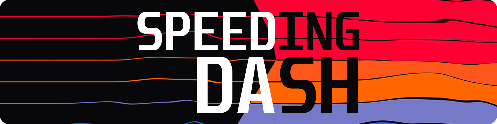

  Wszystko, czego potrzebujesz na trasie, w jednym czytelnym interfejsie. <b>Speeding Dash </b> śledzi realną prędkość GPS i siły G-force, jednocześnie ostrzegając Cię przed fotoradarami. Bez reklam, bez zbędnego klikania - po prostu odpalasz i jedziesz.

 
 

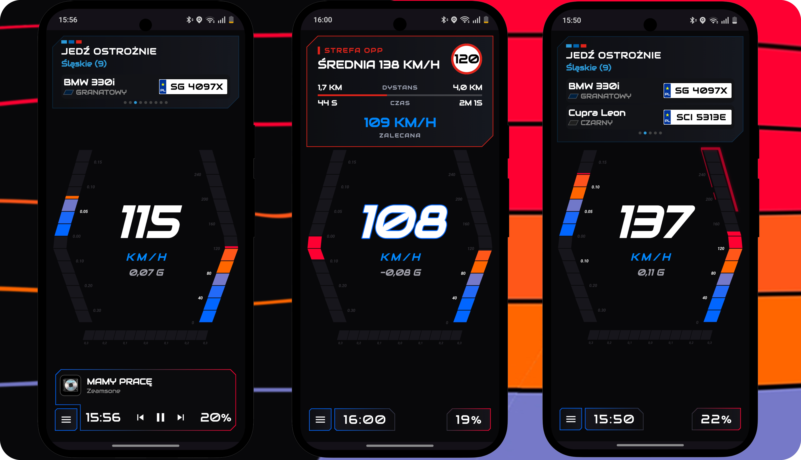

## Szybko, szybciej... jeszcze szybciej!

<table style="border: none; background: transparent;">
  <tr style="border: none; background: transparent;">
    <td width="65%" valign="middle" style="border: none; background: transparent;">
      W <b>Speeding Dash</b> masz stały podgląd na swoją prędkość – zarówno na cyfrowym wyświetlaczu, jak i na dedykowanym zegarze. Co najważniejsze: widzisz <b>realną prędkość z GPS</b>, a nie zawyżone wartości z fabrycznego prędkościomierza Twojego auta.
    </td>
    <td width="35%" align="center" valign="middle" style="border: none; background: transparent;">
      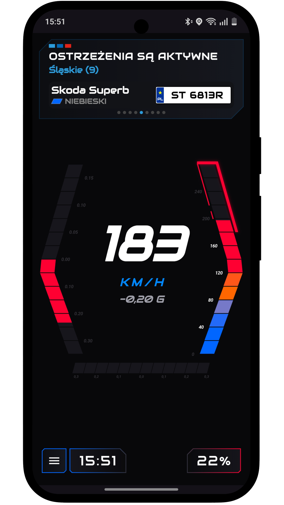
    </td>
  </tr>
</table>

## Wgniata w fotel!

<table style="border: none; background: transparent;">
  <tr style="border: none; background: transparent;">
    <td width="35%" align="center" style="border: none; background: transparent;">
      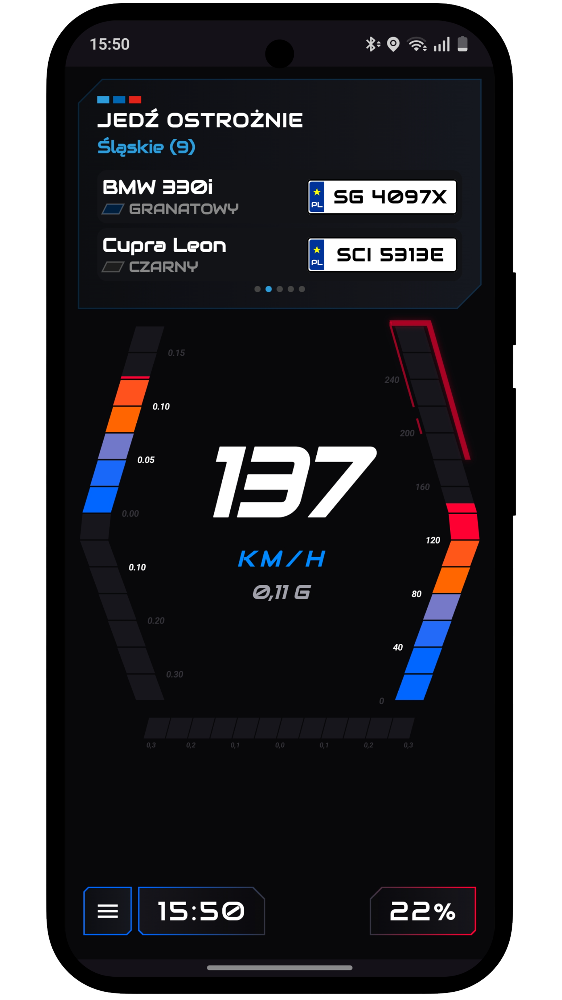
    </td>
    <td width="65%" valign="middle" style="border: none; background: transparent;">
      Śledź na żywo przyspieszenie wzdłużne swojego samochodu. Aplikacja natychmiast reaguje na każdy ruch przepustnicy i mocne dohamowanie, pokazując dokładne siły działające na pojazd. Zakresy wskaźników łatwo dostosujesz do możliwości swojej maszyny i własnych potrzeb.
    </td>
  </tr>
</table>

## Jak trzymasz się w zakrętach?

<table style="border: none; background: transparent;">
  <tr style="border: none; background: transparent;">
    <td width="65%" valign="middle" style="border: none; background: transparent;">
      Sprawdź, jakie przeciążenia boczne generujesz przy dohamowaniach i braniu ciasnych łuków. Dedykowany wskaźnik na ekranie głównym pozwoli Ci lepiej wyczuć granicę przyczepności i idealnie dobrać prędkość na kolejnym ostrym zakręcie. Przedział wskazań skonfigurujesz łatwo kilkoma kliknięciami.
    </td>
    <td width="35%" align="center" valign="middle" style="border: none; background: transparent;">
      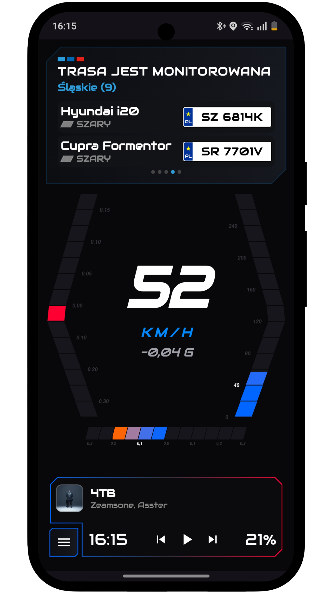
    </td>
  </tr>
</table>

## Masz oko na drogę... my mamy na fotoradary!

<table style="border: none; background: transparent;">
  <tr style="border: none; background: transparent;">
    <td width="35%" align="center" style="border: none; background: transparent;">
      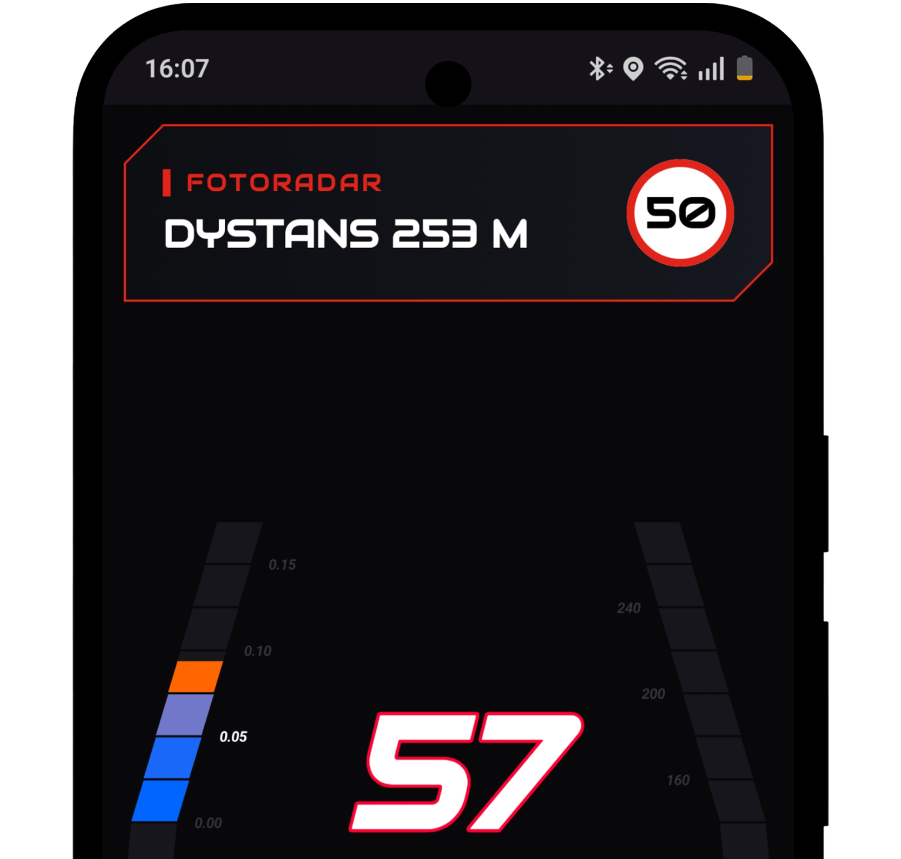
    </td>
    <td width="65%" valign="middle" style="border: none; background: transparent;">
      Aplikacja <b>Speeding Dash</b> ostrzeże Cię o zbliżających się fotoradarach stacjonarnych z odpowiednim wyprzedzeniem. Informację o dystansie do punktu pomiaru zobaczysz na czytelnym panelu, co pozwoli Ci płynnie i bezpiecznie dostosować prędkość bez gwałtownego hamowania w ostatniej chwili.
    </td>
  </tr>
</table>

## Czerwone światło? Zanim zrobi się gorąco...

<table style="border: none; background: transparent;">
  <tr style="border: none; background: transparent;">
    <td width="65%" valign="middle" style="border: none; background: transparent;">
      Dzięki precyzyjnemu systemowi alertów o kamerach na skrzyżowaniach (RedLight) unikniesz kosztownych pomyłek i niebezpiecznych sytuacji. Aplikacja informuje o monitorowanych przejazdach, dając Ci pełną kontrolę i spokój ducha przy dojeżdżaniu do sygnalizacji.
    </td>
    <td width="35%" align="center" valign="middle" style="border: none; background: transparent;">
      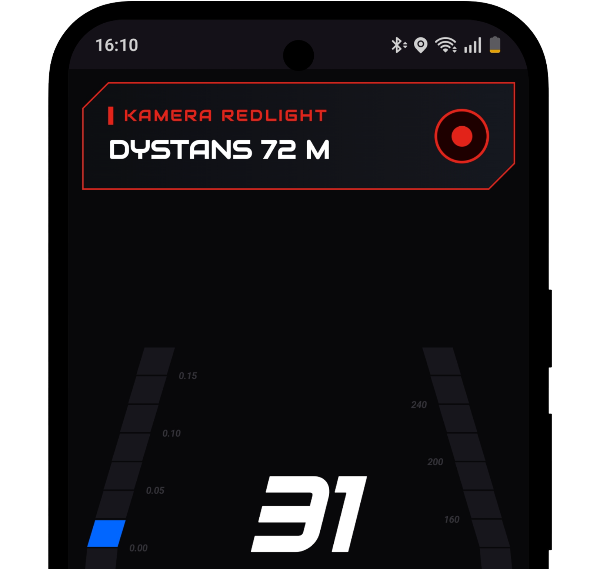
    </td>
  </tr>
</table>

## Odcinkowy pomiar prędkości pod pełną kontrolą

<table style="border: none; background: transparent;">
  <tr style="border: none; background: transparent;">
    <td width="35%" align="center" style="border: none; background: transparent;">
      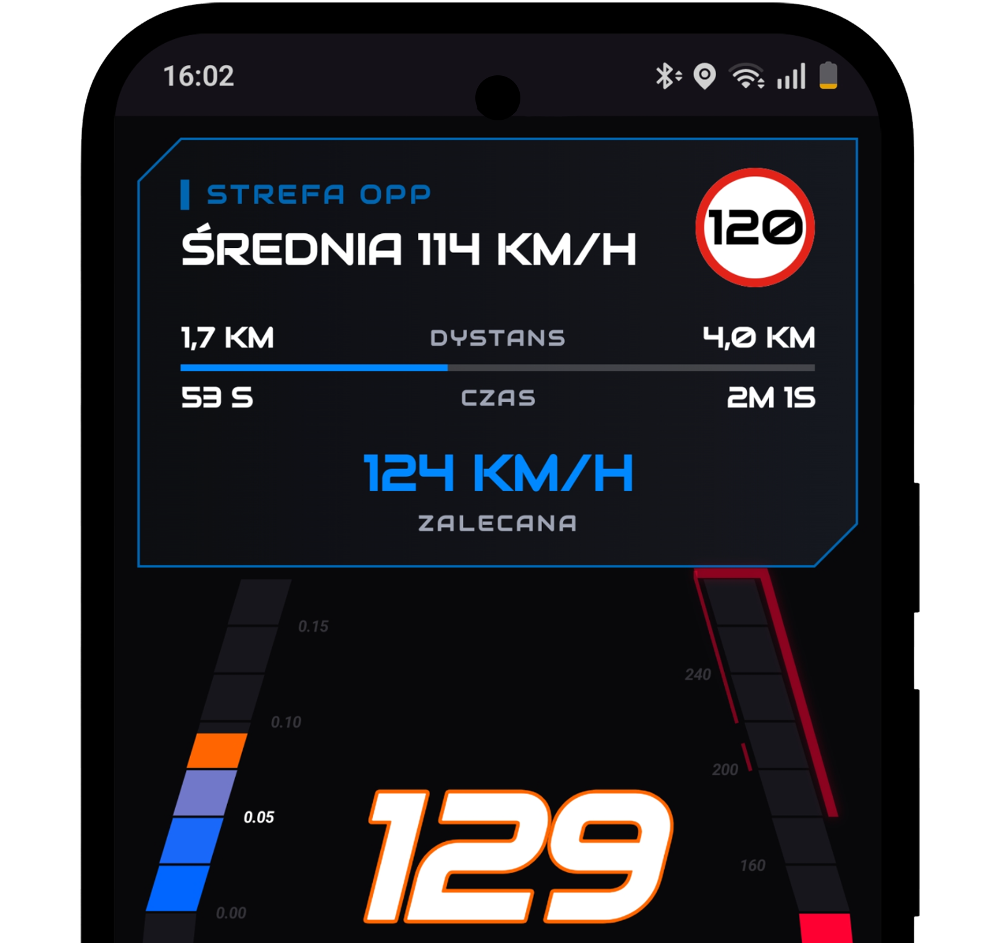
    </td>
    <td width="65%" valign="middle" style="border: none; background: transparent;">
      Wjazd w strefę OPP nie musi oznaczać stresu i ciągłego liczenia w pamięci. <b>Speeding Dash</b> nie tylko wylicza Twoją realną średnią prędkość na danym odcinku, ale dynamicznie podpowiada, z jakiej prędkością powinieneś kontynuować jazdę do końca strefy, aby bezstresowo i zgodnie z przepisami ukończyć pomiar.
    </td>
  </tr>
</table>

## Nieoznakowani w zasięgu? Znamy ich numery!

<table style="border: none; background: transparent;">
  <tr style="border: none; background: transparent;">
    <td width="65%" valign="middle" style="border: none; background: transparent;">
      Wjazd na trasę bez niespodzianek. <b>Speeding Dash</b> wyświetla listę i tablice rejestracyjne nieoznakowanych radiowozów w Twojej okolicy. Masz stały podgląd na podejrzane pojazdy bezpośrednio na ekranie aplikacji.
    </td>
    <td width="35%" align="center" valign="middle" style="border: none; background: transparent;">
      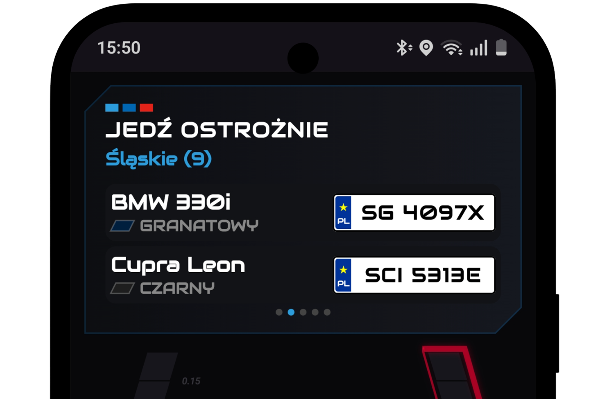
    </td>
  </tr>
</table>

## Też lubisz słuchać muzyki?

<table style="border: none; background: transparent;">
  <tr style="border: none; background: transparent;">
    <td width="35%" align="center" valign="middle" style="border: none; background: transparent;">
      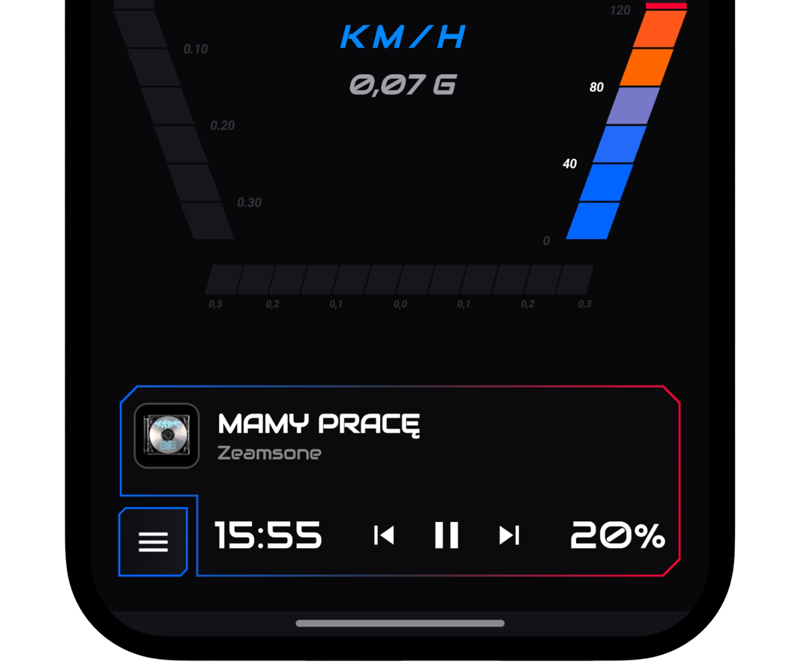
    </td>
    <td width="65%" valign="middle" style="border: none; background: transparent;">
      Jeśli tak, to świetnie się składa, ponieważ aplikacja <b>Speeding Dash</b> pozwala Ci zmieniać piosenki i zarządzać odtwarzaną muzyką bez konieczności przełączania się między aplikacjami i odrywania wzroku od trasy.
    </td>
  </tr>
</table>

## Wszystko, czego potrzebujesz, pod ręką

Aplikacja <b>Speeding Dash</b> umożliwia szybkie uruchamianie Twoich ulubionych aplikacji — np. preferowanej nawigacji czy komunikatora drogowego — bez konieczności przeklikiwania się przez menu telefonu. Jednym kliknięciem na ekranie głównym otworzysz potrzebne narzędzia i ruszysz w trasę, zachowując pełny podgląd telemetrii oraz alertów.

## Zero reklam - zero problemów

Aplikacja **Speeding Dash** nie wyświetla żadnych irytujących reklam, aby nie odciągać uwagi kierowcy i pozwolić skupić się na jeździe w komfortowych warunkach.

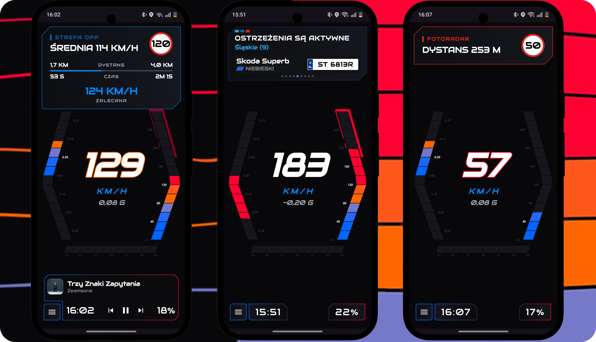

